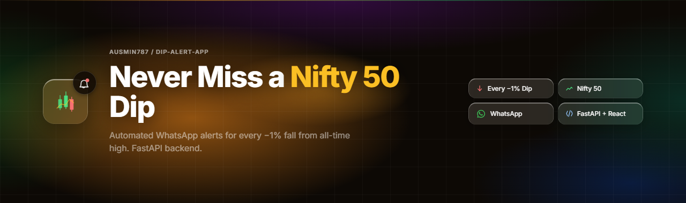
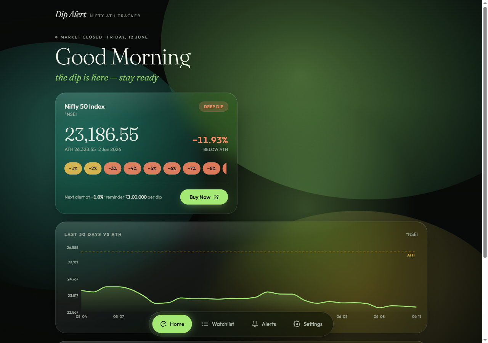

<p align="center">
  
</p>

# Dip Alert — Nifty ATH Tracker

A personal web app that watches the **Nifty 50 index** during NSE market hours, detects every new **−1% level below its all-time high**, and sends a **WhatsApp alert** with a quick-buy link. Inspired by the r/IndianStreetBets strategy: *"Buy ₹1L of Nifty 50 ETF for every −1% fall from ATH."*

<p align="center">
  
</p>

## How it works

```
drop% = (ATH − current) / ATH × 100
Alert fires when floor(drop% / threshold) > last_alerted_level
```

- No re-alerts at the same level within a dip cycle
- Levels reset when price recovers to within 0.5% of ATH (or makes a new ATH)
- Price checks every 5 min (configurable), 9:15 AM–3:30 PM IST, Mon–Fri only
- Per-asset custom threshold %, investment reminder amount, and broker Buy link

## Stack

| Layer | Tech |
|---|---|
| Backend | Python 3.11+, FastAPI, SQLModel (SQLite), APScheduler, yfinance |
| Alerts | CallMeBot WhatsApp API (free, personal use) |
| Frontend | React + Vite, Tailwind CSS v4, Motion, Recharts, Axios (requires Node 20.19+ — Vite 8 floor) |
| Hosting | Oracle Cloud Always Free VM (backend, systemd service), Vercel (frontend) |

## Run locally

**Backend** (http://localhost:8000):

```bash
cd backend
python -m venv .venv
.venv\Scripts\pip install -r requirements.txt   # Windows
.venv\Scripts\python -m uvicorn app.main:app --port 8000
```

**Frontend** (http://localhost:5173, proxies `/api` to the backend):

```bash
cd frontend
npm install
npm run dev
```

**Core-logic tests:**

```bash
cd backend
.venv\Scripts\python test_logic.py
```

## WhatsApp setup (one-time, done by the app's owner)

1. Save `+34 644 59 89 29` in your phone's contacts
2. From WhatsApp, message it: `I allow callmebot to send me messages`
3. You'll get your personal API key back on WhatsApp
4. Open the app's **Settings** page → enter phone (with country code) + API key → **Send test alert**

Credentials live in the app's database — never in code, git, or env vars.

## Deploy (owner's own accounts — zero developer involvement)

**Backend → Oracle Cloud Always Free VM:**
1. Create an Oracle Cloud account and provision an Always Free VM instance (AMD micro or Arm A1 shape)
2. SSH in, install Python 3.11+, clone this repo, create a venv, and `pip install -r backend/requirements.txt`
3. The default `DATABASE_URL` (a local SQLite file) is fine as-is — the VM's disk is persistent, unlike a container platform, so there's no separate volume to configure
4. Set `FRONTEND_ORIGIN=https://<your-vercel-app>.vercel.app` for CORS
5. **Recommended:** set `APP_TOKEN=<any-long-random-string>` — with it set, every write
   (settings, watchlist changes, test alerts) requires that token, so strangers who find
   your URL can't touch anything. Leave it unset and the API is open (fine for local dev).
   It also auto-disables `/docs` and `/openapi.json` once set.
6. Run the app as a `systemd` service (so it restarts on reboot/crash) running
   `uvicorn app.main:app --host 0.0.0.0 --port 8000`
7. Point a domain (even a free one) at the VM's public IP and put a reverse proxy with
   TLS in front of uvicorn — e.g. Caddy or nginx + Let's Encrypt (Caddy auto-provisions
   the certificate with one line of config). **This step isn't optional**: the frontend's
   CSP only allows `connect-src https:`, and browsers block "mixed content" (an HTTPS
   page calling an HTTP API) outright — a bare `http://<ip>:8000` backend will not work
   from the deployed Vercel frontend.
8. That HTTPS domain is your backend URL

**Frontend → Vercel:**
1. Create a Vercel account, import this repo with root directory `frontend`
2. Set env var `VITE_API_URL=https://<your-backend-domain>`
3. Deploy — then open `/settings`, paste your `APP_TOKEN` value into the *Access token*
   field (it appears only when the backend has one set, and is stored only in your browser),
   and configure WhatsApp

## API

```
GET  /api/status            current price, ATH, drop %, next level per asset
GET  /api/history/{ticker}  last N days of closes (chart data)
GET  /api/watchlist         POST /api/watchlist        add asset
PUT  /api/watchlist/{id}    DELETE /api/watchlist/{id}
GET  /api/alerts            paginated alert history
GET  /api/settings          PUT /api/settings
POST /api/test-alert        send a test WhatsApp message
```

Tickers use Yahoo Finance format: `^NSEI` (Nifty 50 index), `SETFNIF50.NS` (SBI Nifty 50 ETF), `RELIANCE.NS` (NSE stocks), `.BO` suffix for BSE.
