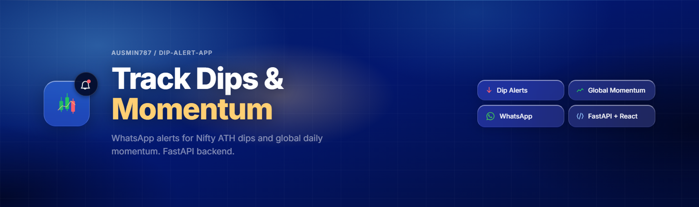
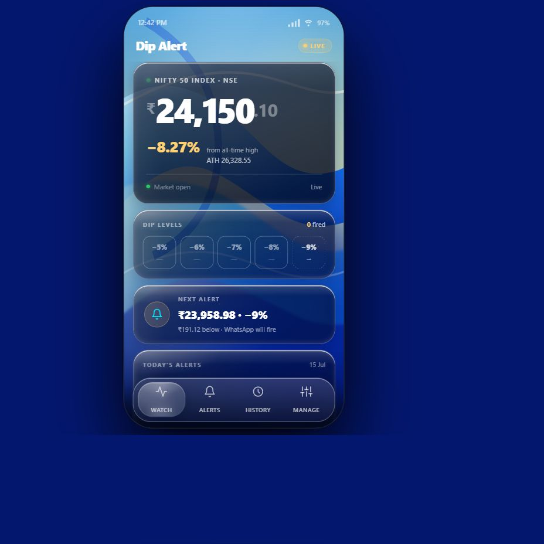

<p align="center">
  
</p>

# Dip Alert — Market Alert Dashboard

A personal web app that watches a small asset list and sends **WhatsApp alerts** for two modes:

- **Dip alerts** for Indian assets such as Nifty 50: fire at each new configured % level below all-time high.
- **Momentum alerts** for global assets such as Gold, Silver, S&P 500, and Nasdaq 100: fire once per UTC day per direction when the daily move crosses the configured threshold.

The original dip strategy is still supported: *"Buy ₹1L of Nifty 50 ETF for every −1% fall from ATH."*

<p align="center">
  
</p>

## How it works

**Dip mode**

```
drop% = (ATH - current) / ATH x 100
Alert fires when floor(drop% / threshold) > last_alerted_level
```

- No re-alerts at the same level within a dip cycle.
- Levels reset when price recovers to within 0.5% of ATH or makes a new ATH.
- Indian dip assets run during NSE market hours, 9:15 AM-3:30 PM IST, Mon-Fri.
- Per-asset custom threshold %, investment reminder amount, and broker Buy link.

**Momentum mode**

```
daily_change% = (current - previous_close) / previous_close x 100
Alert fires once per UTC day per direction when abs(daily_change%) >= threshold
```

- Continuous scheduler evaluation for global and weekend-traded assets without the NSE-hours gate.
- Directional up/down WhatsApp alerts are de-duplicated separately.
- Default seeded global assets use a +/-2% threshold.

## Stack

| Layer | Tech |
|---|---|
| Backend | Python 3.11+, FastAPI, SQLModel (SQLite), APScheduler, yfinance |
| Alerts | CallMeBot WhatsApp API (free, personal use) |
| Frontend | React + Vite, Tailwind CSS v4, GSAP, Axios (requires Node 20.19+ — Vite 8 floor) |
| Deployment targets | Oracle Cloud Always Free VM (backend, systemd service), Vercel (frontend) |

## Interface

The frontend is a mobile-first, four-tab **Liquid Glass** dashboard: **Watch**, **Alerts**, **History**, and **Manage**. Watch includes an accessible 30-day closing-price chart for the selected asset; only that selected history is refreshed, limiting upstream Yahoo requests. The floating bottom navigation uses the web-compatible refraction technique documented by Aave: a generated SVG displacement map and RGB channel offsets appear only while the selector moves. At rest, the filtered duplicate is hidden so the selected icon and label remain crisp. GSAP owns the selector position and motion envelope; reduced-motion users get an immediate, non-refracting transition.

Chromium has been visually verified. Safari and Firefox retain a readable glass-selector fallback but still need physical-browser spot checks for exact SVG-filter rendering.

## Run locally

**Backend** (http://localhost:8000):

```bash
cd backend
python -m venv .venv
.venv\Scripts\pip install -r requirements.txt   # Windows
.venv\Scripts\python -m uvicorn app.main:app --port 8000
```

**Frontend** (http://localhost:5173, proxies `/api` to the backend):

```bash
cd frontend
npm install
npm run dev
```

**Full local verification:**

```powershell
backend\.venv\Scripts\python backend\test_logic.py
backend\.venv\Scripts\python backend\test_security.py
backend\.venv\Scripts\python backend\test_migrations.py
backend\.venv\Scripts\python deploy\test_deploy_safety.py

cd frontend
npm.cmd test
npm.cmd run lint
npm.cmd run build
```

## WhatsApp setup (one-time, done by the app's owner)

1. Save `+34 644 59 89 29` in your phone's contacts
2. From WhatsApp, message it: `I allow callmebot to send me messages`
3. You'll get your personal API key back on WhatsApp
4. Open the app's **Manage** tab → enter phone (with country code) + API key → **Send test alert**

Credentials live in the app's database — never in code, git, or env vars.

## Deploy (owner's own accounts — zero developer involvement)

**Backend → Oracle Cloud Always Free VM:**
1. Create an Oracle Cloud account and provision an Always Free VM instance (AMD micro or Arm A1 shape)
2. SSH in, install Python 3.11+, clone this repo, create a venv, and `pip install -r backend/requirements.txt`
3. The default `DATABASE_URL` (a local SQLite file) is fine as-is — the VM's disk is persistent, unlike a container platform, so there's no separate volume to configure
4. Set `FRONTEND_ORIGIN=https://<your-vercel-app>.vercel.app` for CORS
5. **Recommended:** set `APP_TOKEN=<any-long-random-string>` — with it set, every write
   (settings, watchlist changes, test alerts) requires that token, so strangers who find
   your URL can't touch anything. Leave it unset and the API is open (fine for local dev).
   It also auto-disables `/docs` and `/openapi.json` once set.
6. Run the app as a `systemd` service (so it restarts on reboot/crash) and set up
   **auto-deploy** so backend fixes pushed to `master` roll out on their own — the
   ready-made units, deploy script, and one-time setup steps are in
   [`deploy/README.md`](deploy/README.md). uvicorn binds to `127.0.0.1:8000` there.
7. Point a domain (even a free one) at the VM's public IP and put a reverse proxy with
   TLS in front of uvicorn — e.g. Caddy or nginx + Let's Encrypt (Caddy auto-provisions
   the certificate with one line of config). **This step isn't optional**: the frontend's
   CSP only allows `connect-src https:`, and browsers block "mixed content" (an HTTPS
   page calling an HTTP API) outright — a bare `http://<ip>:8000` backend will not work
   from the deployed Vercel frontend.
8. That HTTPS domain is your backend URL

**Frontend → Vercel:**
1. Create a Vercel account, import this repo with root directory `frontend`
2. Set env var `VITE_API_URL=https://<your-backend-domain>`
3. Deploy — then open the **Manage** tab, paste your `APP_TOKEN` value into the *Access token*
   field (it appears only when the backend has one set, and is stored only in your browser),
   and configure WhatsApp

## API

```
GET  /api/status            current price, mode-aware status, ATH/drop or daily change per asset
GET  /api/history/{ticker}  last N days of closes (chart data)
GET  /api/watchlist         POST /api/watchlist        add asset
PUT  /api/watchlist/{id}    DELETE /api/watchlist/{id}
GET  /api/alerts            paginated alert history
GET  /api/settings          PUT /api/settings
POST /api/test-alert        send a test WhatsApp message
```

Default seeded tickers: `^NSEI` (Nifty 50 dip alert), `GC=F` (Gold), `SI=F` (Silver), `^GSPC` (S&P 500), and `^NDX` (Nasdaq 100).

Tickers use Yahoo Finance format: `^NSEI` (Nifty 50 index), `SETFNIF50.NS` (SBI Nifty 50 ETF), `.NS` for NSE stocks, `.BO` for BSE, `GC=F` / `SI=F` for COMEX futures, and `^GSPC` / `^NDX` for US indices.
